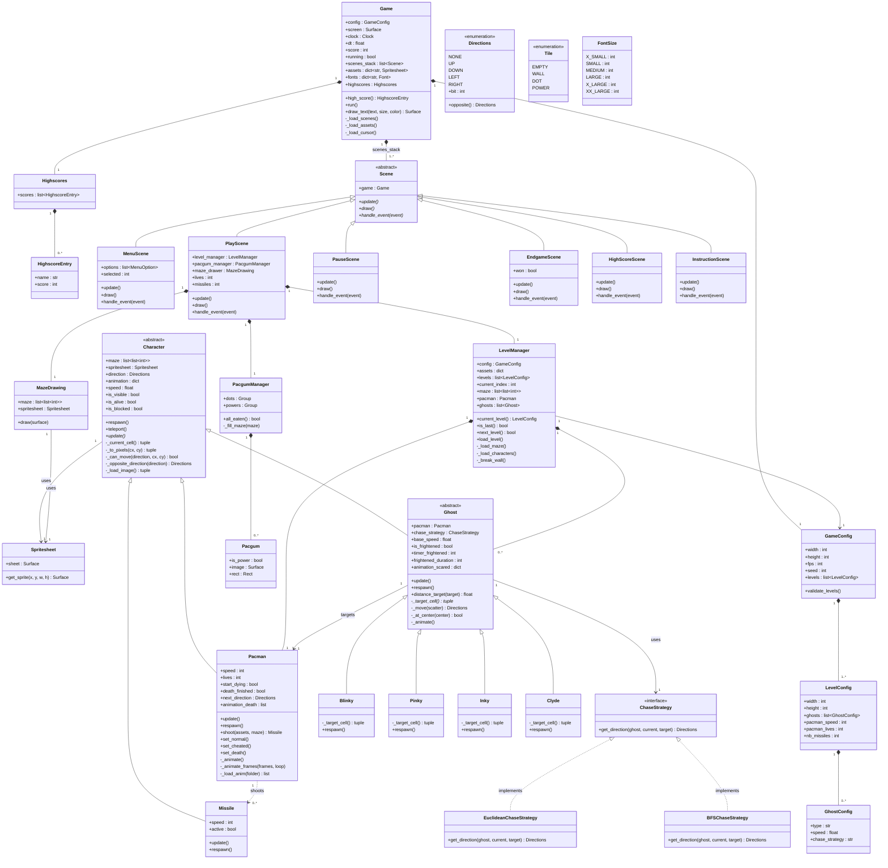

# Class Diagram — Pacman Project

```mermaid
classDiagram

    %% ─────────────────────────────────────────────
    %% CORE CLASSES
    %% ─────────────────────────────────────────────

    class Game {
        +config : GameConfig
        +screen : Surface
        +clock : Clock
        +dt : float
        +score : int
        +running : bool
        +scenes_stack : list~Scene~
        +assets : dict~str, Spritesheet~
        +fonts : dict~str, Font~
        +highscores : Highscores
        +high_score() HighscoreEntry
        +run()
        +draw_text(text, size, color) Surface
        -_load_scenes()
        -_load_assets()
        -_load_cursor()
    }

    class LevelManager {
        +config : GameConfig
        +assets : dict
        +levels : list~LevelConfig~
        +current_index : int
        +maze : list~list~int~~
        +pacman : Pacman
        +ghosts : list~Ghost~
        +current_level() LevelConfig
        +is_last() bool
        +next_level() bool
        +load_level()
        -_load_maze()
        -_load_characters()
        -_break_wall()
    }

    class Spritesheet {
        +sheet : Surface
        +get_sprite(x, y, w, h) Surface
    }

    %% ─────────────────────────────────────────────
    %% CONFIGURATION / PARSER
    %% ─────────────────────────────────────────────

    class GameConfig {
        +width : int
        +height : int
        +fps : int
        +seed : int
        +levels : list~LevelConfig~
        +validate_levels()
    }

    class LevelConfig {
        +width : int
        +height : int
        +ghosts : list~GhostConfig~
        +pacman_speed : int
        +pacman_lives : int
        +nb_missiles : int
    }

    class GhostConfig {
        +type : str
        +speed : float
        +chase_strategy : str
    }

    class HighscoreEntry {
        +name : str
        +score : int
    }

    class Highscores {
        +scores : list~HighscoreEntry~
    }

    %% ─────────────────────────────────────────────
    %% SETTINGS / ENUMERATIONS
    %% ─────────────────────────────────────────────

    class Directions {
        <<enumeration>>
        NONE
        UP
        DOWN
        LEFT
        RIGHT
        +bit : int
        +opposite() Directions
    }

    class Tile {
        <<enumeration>>
        EMPTY
        WALL
        DOT
        POWER
    }

    class FontSize {
        X_SMALL : int
        SMALL : int
        MEDIUM : int
        LARGE : int
        X_LARGE : int
        XX_LARGE : int
    }

    %% ─────────────────────────────────────────────
    %% SCENES
    %% ─────────────────────────────────────────────

    class Scene {
        <<abstract>>
        +game : Game
        +update()*
        +draw()*
        +handle_event(event)*
    }

    class MenuScene {
        +options : list~MenuOption~
        +selected : int
        +update()
        +draw()
        +handle_event(event)
    }

    class PlayScene {
        +level_manager : LevelManager
        +pacgum_manager : PacgumManager
        +maze_drawer : MazeDrawing
        +lives : int
        +missiles : int
        +update()
        +draw()
        +handle_event(event)
    }

    class PauseScene {
        +update()
        +draw()
        +handle_event(event)
    }

    class EndgameScene {
        +won : bool
        +update()
        +draw()
        +handle_event(event)
    }

    class HighScoreScene {
        +update()
        +draw()
        +handle_event(event)
    }

    class InstructionScene {
        +update()
        +draw()
        +handle_event(event)
    }

    %% ─────────────────────────────────────────────
    %% CHARACTERS
    %% ─────────────────────────────────────────────

    class Character {
        <<abstract>>
        +maze : list~list~int~~
        +spritesheet : Spritesheet
        +direction : Directions
        +animation : dict
        +speed : float
        +is_visible : bool
        +is_alive : bool
        +is_blocked : bool
        +respawn()
        +teleport()
        +update()*
        -_current_cell() tuple
        -_to_pixels(cx, cy) tuple
        -_can_move(direction, cx, cy) bool
        -_opposite_direction(direction) Directions
        -_load_image() tuple
    }

    class Pacman {
        +speed : int
        +lives : int
        +start_dying : bool
        +death_finished : bool
        +next_direction : Directions
        +animation_death : list
        +update()
        +respawn()
        +shoot(assets, maze) Missile
        +set_normal()
        +set_cheated()
        +set_death()
        -_animate()
        -_animate_frames(frames, loop)
        -_load_anim(folder) list
    }

    class Ghost {
        <<abstract>>
        +pacman : Pacman
        +chase_strategy : ChaseStrategy
        +base_speed : float
        +is_frightened : bool
        +timer_frightened : int
        +frightened_duration : int
        +animation_scared : dict
        +update()
        +respawn()
        +distance_target(target) float
        -_target_cell()* tuple
        -_move(scatter) Directions
        -_at_center(center) bool
        -_animate()
    }

    class Blinky {
        -_target_cell() tuple
        +respawn()
    }

    class Pinky {
        -_target_cell() tuple
        +respawn()
    }

    class Inky {
        -_target_cell() tuple
        +respawn()
    }

    class Clyde {
        -_target_cell() tuple
        +respawn()
    }

    class Missile {
        +speed : int
        +active : bool
        +update()
        +respawn()
    }

    %% ─────────────────────────────────────────────
    %% GHOST STRATEGIES
    %% ─────────────────────────────────────────────

    class ChaseStrategy {
        <<interface>>
        +get_direction(ghost, current, target) Directions
    }

    class EuclideanChaseStrategy {
        +get_direction(ghost, current, target) Directions
    }

    class BFSChaseStrategy {
        +get_direction(ghost, current, target) Directions
    }

    %% ─────────────────────────────────────────────
    %% MAZE / PACGUM MANAGEMENT
    %% ─────────────────────────────────────────────

    class MazeDrawing {
        +maze : list~list~int~~
        +spritesheet : Spritesheet
        +draw(surface)
    }

    class Pacgum {
        +is_power : bool
        +image : Surface
        +rect : Rect
    }

    class PacgumManager {
        +dots : Group
        +powers : Group
        +all_eaten() bool
        -_fill_maze(maze)
    }

    %% ─────────────────────────────────────────────
    %% RELATIONSHIPS
    %% ─────────────────────────────────────────────

    %% -- Inheritance --
    Scene <|-- MenuScene
    Scene <|-- PlayScene
    Scene <|-- PauseScene
    Scene <|-- EndgameScene
    Scene <|-- HighScoreScene
    Scene <|-- InstructionScene

    Character <|-- Pacman
    Character <|-- Ghost
    Character <|-- Missile
    Ghost <|-- Blinky
    Ghost <|-- Pinky
    Ghost <|-- Inky
    Ghost <|-- Clyde

    ChaseStrategy <|.. EuclideanChaseStrategy : implements
    ChaseStrategy <|.. BFSChaseStrategy : implements

    %% -- Composition / Aggregation --
    Game "1" *-- "1..*" Scene : scenes_stack
    Game "1" *-- "1" GameConfig
    Game "1" *-- "1" Highscores

    PlayScene "1" *-- "1" LevelManager
    PlayScene "1" *-- "1" PacgumManager
    PlayScene "1" *-- "1" MazeDrawing

    LevelManager "1" *-- "1" Pacman
    LevelManager "1" *-- "0..*" Ghost
    LevelManager "1" --> "1" GameConfig

    Ghost "1" --> "1" Pacman : targets
    Ghost "1" --> "1" ChaseStrategy : uses
    Pacman "1" ..> "0..*" Missile : shoots

    PacgumManager "1" *-- "0..*" Pacgum

    GameConfig "1" *-- "1..*" LevelConfig
    LevelConfig "1" *-- "0..*" GhostConfig
    Highscores "1" *-- "0..*" HighscoreEntry

    Character "1" --> "1" Spritesheet : uses
    MazeDrawing "1" --> "1" Spritesheet : uses
```
